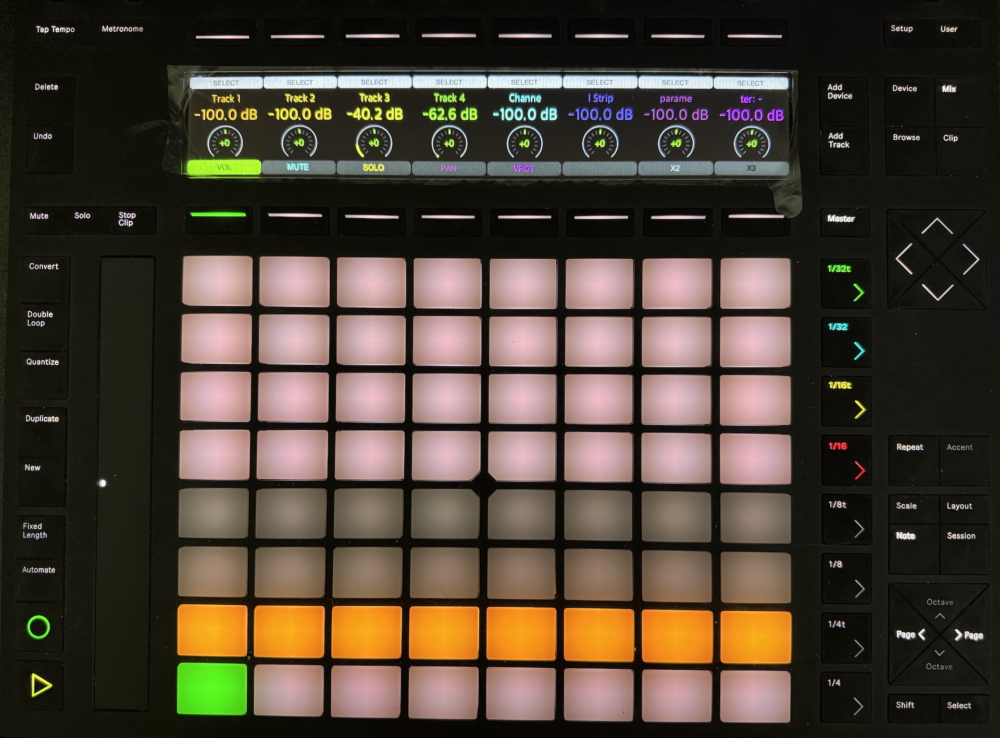
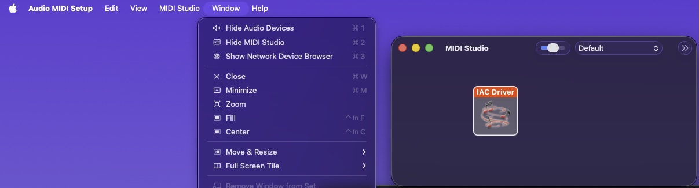
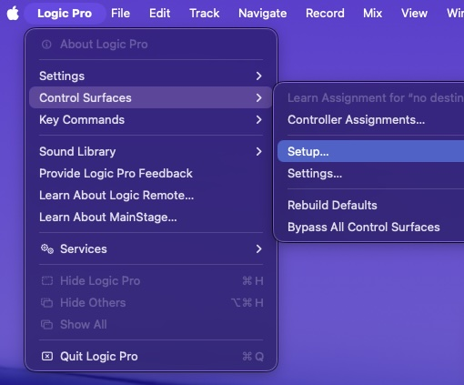
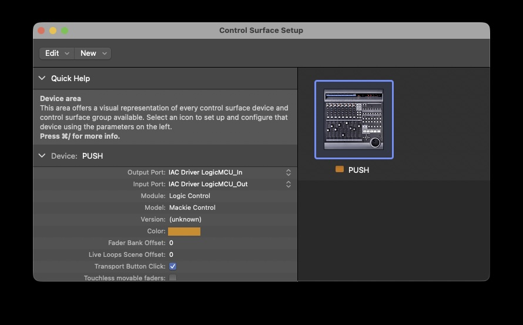
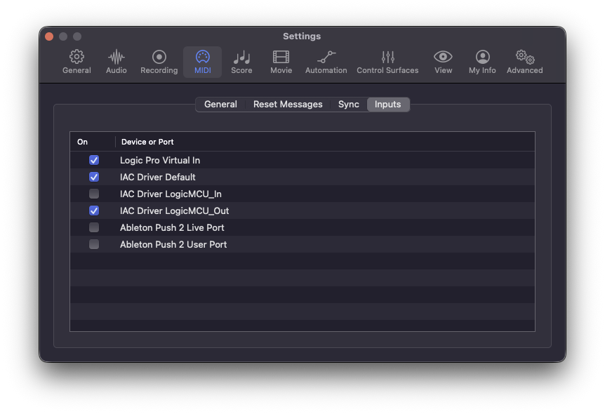
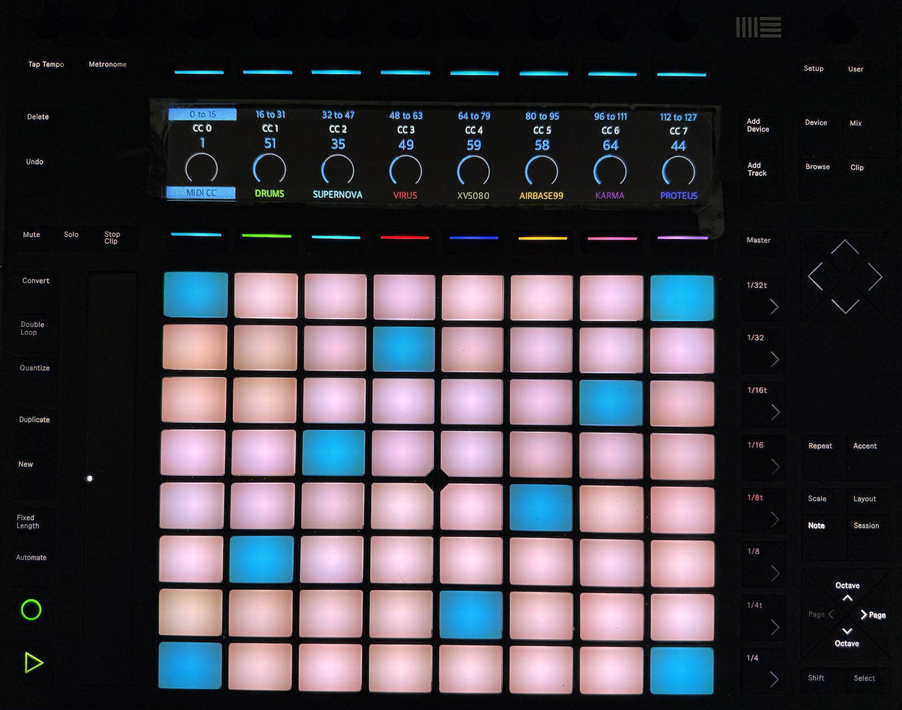
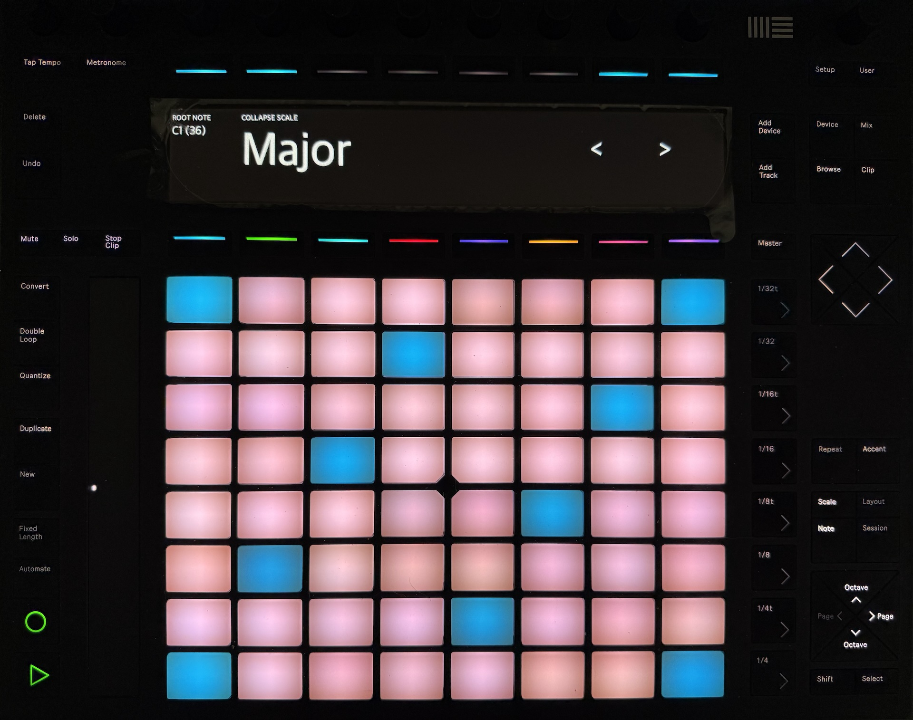

# LogicX-Push2 - Logic Pro 11.2.2 - Apple Silicon OS 26.x





Follow along for proper installation:

Step 1) - open ```Audio Midi Setup```

Step 2) - ```Window > Show Midi Studio (Command + 2)```



Step 3) - Create "Default" / "LogicMCU_In" / "LogicMCU_Out" and make sure the [X] "Device is online"


Step 4) - Logic Pro > Control Surfaces > Setup...   > Add Mackie Control (no scan, just add)



Step 5) - Add "Mackie Control"  - 
Set the OUTPUT PORT to `IAC Driver LogicMCU_In`
Set the INPUT PORT to `IAC Driver LogicMCU_Out`

Note that out goes to in, in goes to out.... 

You can double click next to "Device:" and name it whatever you want... I call mine "PUSH"




# **EXTREMELY IMPORTANT!!!**

you MUST disable "Ableton Push2 Live and User ports" going into Logic, you must DISABLE LogicMCU_In
you MUST enable Default / and OUT

(any other midi and devices are fine, Unitor8, external gear, 3rd party keyboards, they are fine to leave on)




Prerequisites (install in Terminal):
```
echo "3.12.8" > .python-version

xcode-select --install

/bin/bash -c "$(curl -fsSL https://raw.githubusercontent.com/Homebrew/install/HEAD/install.sh)"

brew install python@3.12 pkg-config cairo pango gdk-pixbuf libusb

```
from repo root / 
```
/opt/homebrew/opt/python@3.12/bin/python3.12 -m venv .venv
source .venv/bin/activate
python -m pip install -U pip setuptools wheel
python -m pip install -r requirements.txt
python app.py
```

IF YOU DO NOT SEE OR HEAR ANY MIDI when pressing the pads on the push2 in Logic, YOU MUST GO IN THE `Setup` button on Push2 (press it twice to get to page 2) and make sure the default Midi out is set to the IAC DEFAULT.



LogicX-Push2 allows your ableton PUSH2 to have more functionality in Logic Pro beyond the default "user" mode.
**LogicX-Push2** is based on the source code for Psyha, which  is a Python 3 app to use **Push2 as a standalone MIDI controller**. It has mainly been designed to work as a controller for [Apple's Logic PRO](https://www.apple.com/logic-pro/), but it can also be used as a generic controller. To run LogicX-Push2, you just need to install Python requirements and run `app.py` on a computer connected to Push2 and with a MIDI interface to output messages.

### New Features include:
* NO LONGER NEED OSCulator (keybinds are now from a json file)
* Collapsible Scales – Hide unused pads and display only the notes in your selected scale, giving you a cleaner, more focused playing surface.
* Updated Frontend UI
* Updated Transport Controls (Stop / Play / Record / Metronome / Mute / Solo )
* Better Navigation Controls
* External Hardware / Software Instrument Midi CC configuration and mapping with up to various instrument*
* Access to PUSH2 Scale Type
* Multi Function Pads and Buttons ( shift state / alternate state / single press / double press / long press )
* Full keybind support for Logic Pro (bind any key in Logic to anything on the PUSH2)

#### Other Features
* Use classic 4x4 (and up to 8x8!) pad grid in the rhythm layout mode
* Choose between channel aftertouch and polyphonic aftertouch
* Use *accent* mode for fixed 127 velocity playing
* Use touchstrip as a pitch bend or modulation wheel
* Interactively adjust velocity/aftertouch sensitivity curves
* Merge MIDI in from a MIDI input and also send it to the main MIDI out
* Interactively configure MIDI in/out settings
* Send MIDI control CC data using the encoders, use synth definition files to show controls and control names in a meaningful way
* Select track instrument presets by sending program change messages
* Temporarily disable screen rendering
* Save current settings so these are automatically loaded on next run
* Easy software update (provided an internet connection is working)


## User manual

Here are some notes about how to use LogicX-Push2:

* Arrow Keys are mapped to physical arrow keys on keyboard.
* Press `Scale` button to change scales, collapse scales.  Use < > buttons or rotary encoder knob to cycle through scales.
* Outside of `Scale` mode, you can still press `Shift` + `Scale` to collapse or uncollapse a scale outside the menu.
* Press `Note` button to toggle between rhythmic/melodic layouts.
* Use `Ocateve up` and `Octave down` buttons to change octaves.
* Press `Shift + Accent` button to toggle between pitch bend/modulation wheel modes for the touchstrip.
* Press `Accent` button to activate fixed velocity mode (all notes will be triggered with full 127 velocity).
* Press `Setup` button several times to cycle through configuration pages where you'll find options to:
    * Set MIDI out device and channel
    * Set MIDI in device and channel (for MIDI merge functionality)
    * Set MIDI root note
    * Toggle between polyphonic/channel aftertouch modes
    * Configure channel pressure range and velocity/polyphonic aftertouch pad response curves
    * Save current settings to file (will be loaded automatically when LogicX-Push2 runs again)
    * Run software update (to update LogicX-Push2 version, requires internet connection)
    * Reset Push MIDI configuration (sometimes this is needed if not all pads are lit as expected or you see wrong button colors)
* Select External Hardware/Software Midi CC instruments 1-8 by pressing the 8 buttons right above the pads.
* Navigate between groups of CC controls using the 8 buttons above the display, and the `Page left`/`Page right` buttons.
* Use instrument definition files to show proper MIDI CC control names and group them in meaningful sections. See examples in the `instrument_definitions` folder.
* Customize track contents editing the `track_listing.json` file. What comes by default is what I use in my setup.
* Press `SHIFT + Long press / User BUTTON` button to deactivate the display (useful for slow computers running LogicX-Push2).
* Press `Add device` button to enter *Preset selection mode* (or hold the button to only momentarily activate that mode). While in this mode, press any of the 64 pads to send a program change message to the corresponding track synth with values 0-63. This allows you to select one of the first 64 presets for the current bank. Long-press one of the pads to mark this preset as "favourite" and highlight it (this info is saved). Long-press again to "unfavorite" the preset. Use left and right arrows to move to the next 64 presets (64-127) and iterate through available banks.
 
* 
