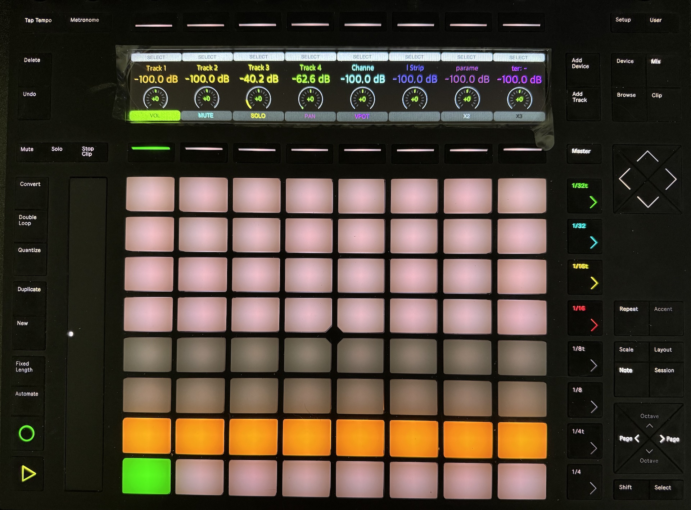
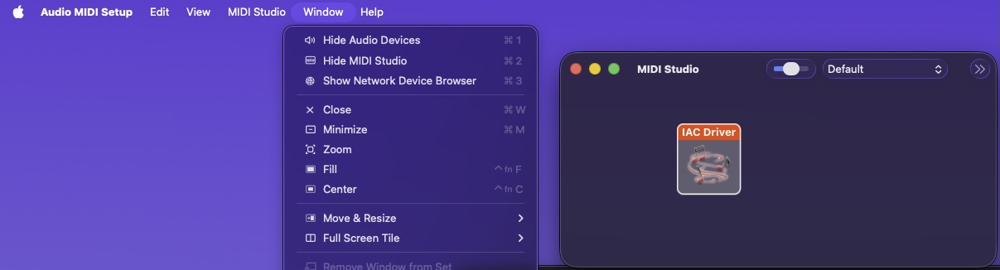
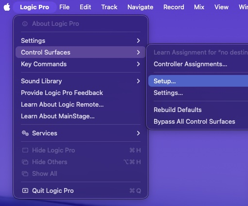
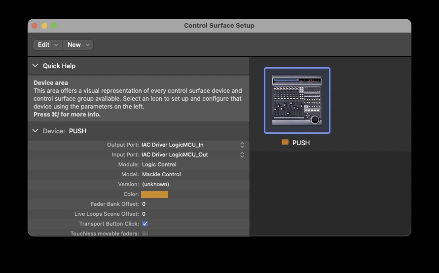
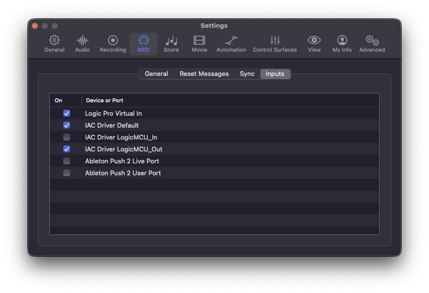
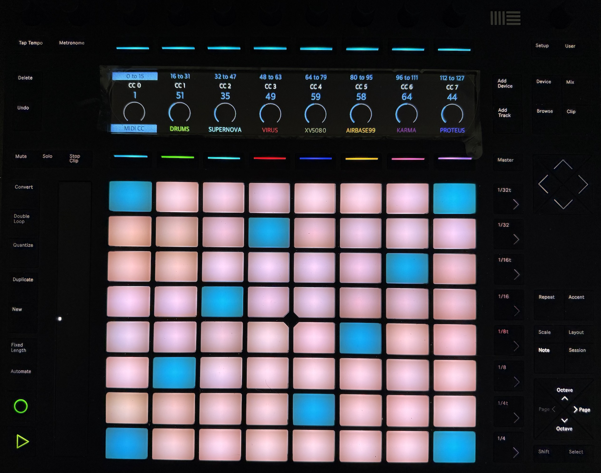
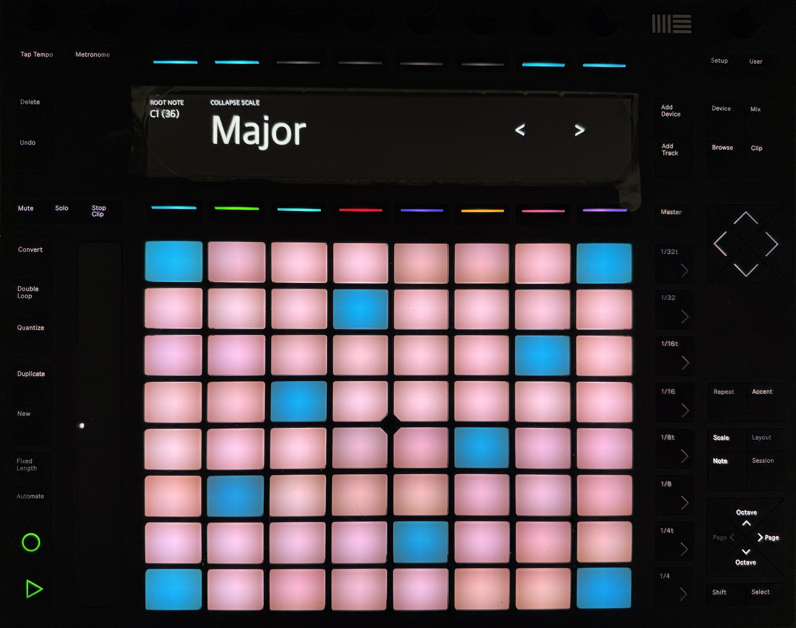

# LogicX-Push2

### Ableton Push 2 as a full Logic Pro controller

[](https://www.paypal.com/ncp/payment/TW8B5WJPBXX88)



LogicX-Push2 is a Python app that turns your **Ableton Push 2** into a native **Logic Pro** controller. It runs alongside Logic and provides MCU mixing, melodic and rhythmic pad layouts, scale selection, customizable keybinds, external instrument CC mapping, and a macOS launcher app — no OSCulator required.

---

## Requirements

- macOS (Apple Silicon or Intel)
- Ableton Push 2 (connected via USB)
- Logic Pro (tested on 11.2.2)
- Xcode Command Line Tools, Homebrew, Python 3.12 *(handled automatically by the installer)*

---

## Installation

### Easy Install — Push2.app (Recommended)

1. Download the latest **Push2.app** from [Releases](https://github.com/zurie/LogicX-Push2/releases)
2. Clone or download this repo:
   ```
   git clone https://github.com/zurie/LogicX-Push2.git
   ```
3. Double-click **Push2.app** — it will ask you to choose the repo folder on first launch
4. Click **Setup... → Install Deps** — this opens Terminal and runs `install.sh` automatically
   - Installs Homebrew (if missing), Python 3.12, system libraries, and all Python packages
5. After the install completes, click **Run** to launch

The launcher also checks for new releases on startup and can update itself automatically.

### First Launch — Approve in macOS Privacy & Security

**Push2.app** is open-source and signed for local use, but it is **not notarized by Apple**, so macOS Gatekeeper will block it the first time. This is expected — you only need to do this once.

When you double-click **Push2.app** you'll see a warning like *“Apple could not verify Push2.app is free of malware”* (or *“…cannot be opened because it is from an unidentified developer”*). To allow it:

1. Open  **Apple menu → System Settings → Privacy & Security**.
2. Scroll down to the **Security** section. You'll see a message:
   *“Push2.app was blocked to protect your Mac.”*
3. Click **Open Anyway**.
4. Confirm with **Open** (and Touch ID / your password) in the dialog that follows.

> **Alternatively** (fastest): right-click (or Control-click) **Push2.app → Open**, then click **Open** in the dialog. Right-clicking gives you the **Open** option even when a normal double-click won't.
>
> **Command line:** you can also clear the quarantine flag yourself with:
> ```bash
> xattr -dr com.apple.quarantine /path/to/Push2.app
> ```

After you approve it once, it launches normally from then on — including after auto-updates.

### Manual Install

Open Terminal in the repo folder and run:

```bash
# Install Xcode command line tools (if not already installed)
xcode-select --install

# Install Homebrew (if not already installed)
/bin/bash -c "$(curl -fsSL https://raw.githubusercontent.com/Homebrew/install/HEAD/install.sh)"

# Install system dependencies
brew install python@3.12 pkg-config cairo pango gdk-pixbuf libusb

# Create virtual environment and install Python packages
/opt/homebrew/opt/python@3.12/bin/python3.12 -m venv .venv
.venv/bin/pip install --upgrade pip
.venv/bin/pip install -r requirements.txt
```

---

## MIDI Setup (Logic Pro)

These steps are required before LogicX-Push2 will communicate with Logic Pro.

**Step 1** — Open **Audio MIDI Setup** → `Window > Show MIDI Studio` (`Cmd+2`)



**Step 2** — Open the **IAC Driver** and create three buses named exactly:
- `Default`
- `LogicMCU_In`
- `LogicMCU_Out`

Make sure **Device is online** is checked for each.


**Step 3** — In Logic Pro: `Control Surfaces > Setup... > Add > Mackie Control` (do not scan — add manually)

Set the ports as follows:
- **Output Port:** `IAC Driver LogicMCU_In`
- **Input Port:** `IAC Driver LogicMCU_Out`

*(Note: output goes to input and vice versa — this is correct.)*





**Step 3a — Set the Channel Strip Parameter to "Pan"**

In the Mackie Control's inspector (right-click the control surface → **Show/Hide Inspector**, or open it from the setup window), set **Channel Strip Parameter** to **Pan**. This makes the encoders/V-Pots address pan correctly so PAN mode on the Push 2 works as expected.

**Step 4 — CRITICAL: MIDI Port Settings in Logic**

- **Disable** the "Ableton Push 2" Live and User ports going into Logic
- **Disable** `LogicMCU_In` as a generic MIDI input
- **Enable** `Default` and `OUT`

Other MIDI devices (keyboards, external gear) can remain enabled.



> **If you press pads but hear no MIDI in Logic:** Press **Setup** on the Push 2 twice to reach page 2 (MIDI settings) and confirm the MIDI output is set to `IAC Driver Default`.



---

## Running

**Using Push2.app:** Click **Run** in the launcher.

**Manually from the repo root:**
```bash
./run.sh
```

---

## Modes Overview

| Mode | How to Activate | Description |
|------|-----------------|-------------|
| **Melodic** | `Note` button (toggle) | Piano-style chromatic pad layout in any scale |
| **Rhythmic** | `Note` button (toggle) | Fixed 4×4 drum pad grid |
| **Mackie Control** | Always active (runs concurrently) | MCU mixing — Volume, Pan, Mute, Solo, Rec per track |
| **Scale Menu** | `Scale` button | Choose root note and scale type |
| **Settings** | `Setup` button (cycles 3 pages) | MIDI config, aftertouch, save settings, software update |
| **Help** | `User` button | Press any button to see its name, shortcut, and description |
| **Repeat** | `Repeat` button | Note repeat with quantize grid selection |

---

## User Manual

### General Controls

| Button | Action |
|--------|--------|
| **Arrow keys** | Navigate in Logic (mapped to keyboard arrows) |
| **Shift + Arrow** | Select while navigating |
| **Undo** | Cmd+Z |
| **Undo** (long press) | Redo (Cmd+Shift+Z) |
| **Play** | Play/Stop (Space) |
| **Play** (long press) | Stop |
| **Record** | Record (`R`) |
| **Tap Tempo** | Tap Tempo (`Shift+Ctrl+Alt+Cmd+T`) — *custom key command, see below* |
| **Metronome** | Toggle metronome (`K`) |
| **Delete** | Delete (`Delete`) |
| **Duplicate** | Duplicate (`D`) |
| **Quantize** | Quantize (`Q`) |
| **Automate** | Automate (`A`) |
| **Mute** | Mute (`M`) |
| **Solo** | Solo (`S`) |

> **Tap Tempo requires a custom key command.** Logic has no Tap Tempo shortcut by default. In Logic Pro, go to `Logic Pro → Settings → Key Commands` (or `Cmd+K`/`Alt+K`), search for **Tap Tempo**, and assign it to **`Shift+Ctrl+Alt+Cmd+T`** so the Push 2 Tap Tempo button works. See [KEYBINDS.md](KEYBINDS.md).

---

### Melodic Mode

The pad grid uses a **chromatic layout** with a 5-semitone offset between rows, allowing all notes of a scale to be reachable across the grid.

- **Octave Up / Octave Down** — shift the root note ±12 semitones
- **Scale** button — open the scale picker GUI
- **Shift + Scale** — collapse or uncollapse the scale (collapsed mode shows only in-key notes, hiding out-of-scale pads)
- **Accent** — enable fixed velocity mode (all notes play at 127)
- **Shift + Accent** — toggle the touchstrip between **Pitch Bend** and **Mod Wheel (CC1)** modes
- Aftertouch mode (polyphonic or channel) is configured in Settings page 1



---

### Rhythmic Mode

A fixed **4×4 drum pad** layout. Note assignments are fixed (MIDI notes 36–99).

- Left 4×4 pads: track color (primary drum pads)
- Right 4×4 pads: gray auxiliary pads
- Octave and Scale buttons are inactive in this mode

---

### Repeat Mode

Press **Repeat** to activate Logic's note repeat. While active, press any of the 8 quantize grid buttons to set the repeat rate:

`1/32T` · `1/32` · `1/16T` · `1/16` · `1/8T` · `1/8` · `1/4T` · `1/4`

Release **Repeat** to turn it off.

> The quantize grid shortcuts require custom key commands to be assigned in Logic's Key Commands editor. See [KEYBINDS.md](KEYBINDS.md) for the required shortcut assignments.

---

### Help Mode

Press the **User** button to enter Help mode. Then press any button on the Push 2 to see:
- Button name
- Logic Pro keyboard shortcut
- Logic menu path
- Description

Use the **arrow keys** to scroll through multi-page entries. Press **User** again to exit.

---

### Settings (Setup button — 3 pages)

Press **Setup** repeatedly to cycle through three configuration pages:

**Page 1 — Performance**
- Root MIDI note
- Aftertouch mode: Polyphonic or Channel
- Channel aftertouch range (start/end)
- Polyphonic aftertouch max range and curve
- Collapse scale on startup toggle

**Page 2 — MIDI**
- MIDI output device and channel
- MIDI input device and channel (for MIDI merge)
- Notes MIDI input device

**Page 3 — About / Maintenance**
- Save current settings to file (auto-loaded on next run)
- Software update (git pull)
- FPS display
- Debug logging toggle

---

## Mackie Control Mode

Mackie Control (MCU) mode runs **concurrently with all other modes** and maps 8 Logic Pro tracks directly to the Push 2 pad grid. It is active whenever `use_mcu: true` in `settings.json` (enabled by default).

### Pad Grid Layout

```
Row 7 (top):  Mode selector  [ VOL ][ MUTE ][ SOLO ][ PAN ][ VPOT ][ EXT1 ][ EXT2 ][ EXT3 ]
Row 6:        F-keys         [  F1 ][  F2  ][  F3  ][  F4 ][  F5  ][  F6  ][  F7  ][  F8  ]
Row 3:        Record arm     [ REC ][ REC  ][ REC  ][ REC ][ REC  ][ REC  ][ REC  ][ REC  ]
Row 2:        Solo           [ SOL ][ SOL  ][ SOL  ][ SOL ][ SOL  ][ SOL  ][ SOL  ][ SOL  ]
Row 1:        Mute           [ MUT ][ MUT  ][ MUT  ][ MUT ][ MUT  ][ MUT  ][ MUT  ][ MUT  ]
Row 0 (bot):  Select track   [ SEL ][ SEL  ][ SEL  ][ SEL ][ SEL  ][ SEL  ][ SEL  ][ SEL  ]
```

**Pad colors:**
- SELECT → green (bright = active track)
- MUTE → sky blue (lit = muted)
- SOLO → yellow (lit = soloed)
- REC → red (lit = armed)
- F-keys → white

### Mode Selector (Row 7)

Pressing a mode button switches what the **8 encoders** control:

| Button | Color | Encoder Behavior |
|--------|-------|-----------------|
| VOL | Green | Volume (pitchbend per channel) |
| MUTE | Sky | — (mute view) |
| SOLO | Yellow | — (solo view) |
| PAN | Orange | Pan (CC 16–23 per channel) |
| VPOT | Pink | VPot / plugin control |
| EXT1–3 | Gray/Green/Red | Custom mappings |

### Encoders

- **VOL / MUTE / SOLO modes:** Each encoder controls volume via pitchbend on its channel
- **PAN mode:** Each encoder sends CC 16–23 for pan on its channel
- The display shows track name, volume in dB, and a pan indicator ring per channel

### Page Navigation

- **Page Left / Page Right** — shift the 8-channel bank (no Shift held)
- **Shift + Page Left / Page Right** — shift the track page

### Special Buttons

| Button | Action |
|--------|--------|
| `1/32` | Clear all **mutes** in current bank |
| `1/16T` | Clear all **solos** in current bank |
| `Master` | Force MCU flip off |

---

## Keybindings

See **[KEYBINDS.md](KEYBINDS.md)** for the complete keybinding reference.

Quick reference for the most common buttons:

| Push 2 Button | Logic Shortcut | Action |
|---|---|---|
| Play | `Space` | Play / Stop |
| Record | `R` | Record |
| Undo | `Cmd+Z` | Undo |
| Undo (long press) | `Cmd+Shift+Z` | Redo |
| Delete | `Delete` | Delete |
| Duplicate | `D` | Duplicate |
| Mute | `M` | Mute |
| Solo | `S` | Solo |
| Quantize | `Q` | Quantize |
| Browse | `Y` | Browse |
| Mix | `X` | Show Mixer |
| Device | `B` | Show Device |
| Clip | `C` | Show Clip |
| Add Track | `T` | Add Track |
| Automate | `A` | Automate |

All keybindings are fully customizable by editing `push2_keymap.json`.

---

## Updating

**Auto-update (Push2.app):** The launcher checks GitHub Releases on startup and prompts you if a newer version is available. Accept to download and install automatically — the app will relaunch itself.

**Manual update via launcher:** `Setup... → Check Updates`

**Manual update via terminal:**
```bash
git pull
./install.sh
```

**From inside the controller:** Press `Setup` → page 3 → Software Update.

---

## Features

- No OSCulator needed — keybinds are defined in a plain JSON file
- Collapsible scales — hide out-of-scale pads for a cleaner playing surface
- MCU mixing layer — Volume, Pan, Mute, Solo, Record Arm for 8 tracks at once
- Full transport controls (Play, Stop, Record, Metronome, Tap Tempo)
- Melodic and Rhythmic pad layouts
- Polyphonic and Channel aftertouch with adjustable curves
- Accent mode for fixed 127 velocity
- Touchstrip as Pitch Bend or Mod Wheel
- External instrument MIDI CC mapping with instrument definition files
- Multi-function buttons (shift / long press / alternate states)
- Save and auto-load settings
- macOS launcher app with auto-update from GitHub Releases

---

## License

See [LICENSE](LICENSE).

---

[](https://www.paypal.com/ncp/payment/TW8B5WJPBXX88)

*If LogicX-Push2 is useful to you, consider buying me a coffee.*
